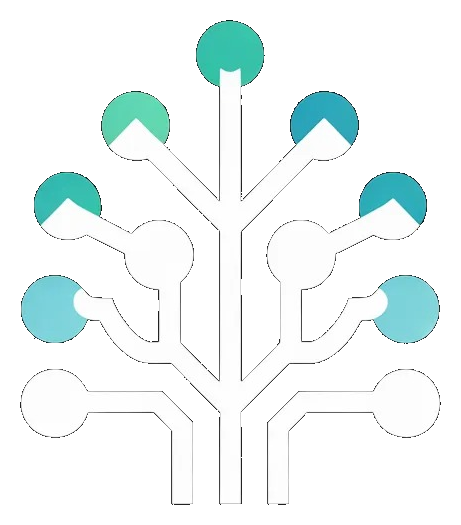

# MyDSA

<div align="center">
  
  <br/>
  <br/>
  <strong>A structured, concept-gated DSA roadmap for serious interview prep.</strong>
  <br/>
  <br/>
  
  
  
  
</div>

---

## Overview

MyDSA is a personal DSA tracker built around one idea: **you shouldn't attempt a problem until you understand the concept behind it.**

Every section is gated behind a "Learn Before" panel — a curated list of topics to study first, written specifically for Python, Java, or C++. Once you're ready, work through the problems, check them off, and leave notes. Progress is saved locally — no account, no backend, no tracking.

---

## Features

- **286 LeetCode problems** organised across 13 progressive phases
- **Concept-gated sections** — each section has a "Learn Before" panel with language-specific topics to study first
- **3 language modes** — Python, Java, C++ (switches the Learn Before content)
- **⭐ Starred problems** — high interview-frequency must-dos highlighted at a glance
- **Per-problem notes** — jot down insights, approaches, or edge cases. Auto-saved.
- **Progress tracking** — per-problem, per-section, per-phase, and overall
- **Sticky sidebar nav** — jump between phases instantly, see progress at a glance
- **Pattern tags** — each problem shows its technique (e.g. Sliding Window, Union-Find)
- **Persistent state** — everything saved to `localStorage`, survives page refreshes
- **Reset anytime** — one-click full reset with a confirmation guard
- **Zero dependencies on a backend** — fully static, runs anywhere

---

## The 13 Phases

| Phase | Topic |
|---|---|
| 1 | Arrays & Strings — Foundation |
| 2 | Basic Binary Search |
| 3 | Stacks, Queues & Linked Lists |
| 4 | Full Binary Search — Medium + Hard |
| 5 | Two Pointers, Sliding Window & Prefix Sum |
| 6 | Trees (Easy) → Heaps → Trees (Medium) |
| 7 | Backtracking |
| 8 | Greedy |
| 9 | DP Wave 1 — 1D, Sequences, Basic 2D |
| 10 | Graphs |
| 11 | DP Wave 2 — Knapsack, Interval, Stock, Hard |
| 12 | Bit Manipulation & Math |
| 13 | Hard Consolidation + Segment Tree Intro |

---

## Tech Stack

| | |
|---|---|
| Framework | Next.js 15 (App Router) |
| Language | TypeScript |
| Styling | CSS custom properties + inline styles |
| State | React `useState` + `localStorage` |
| Fonts | Inter + JetBrains Mono |
| Deployment | Vercel |

No UI library. No state management library. No database.

---

## Getting Started

### Prerequisites

- Node.js 18+
- npm

### Run locally

```bash
git clone https://github.com/Symphony007/DSA-Master-Sheet.git
cd DSA-Master-Sheet
npm install
npm run dev
```

Open [http://localhost:3000](http://localhost:3000).

### Build for production

```bash
npm run build
npm start
```

---

## Project Structure

```
mydsa/
├── components/
│   ├── Header.tsx          # Sticky top bar — progress, lang switcher, reset
│   ├── PhaseNav.tsx        # Sidebar navigator with per-phase progress
│   ├── PhaseCard.tsx       # Expandable phase accordion
│   ├── SectionCard.tsx     # Section within a phase
│   ├── LearnBefore.tsx     # Collapsible concept guide panel
│   ├── PatternGroup.tsx    # Problem group by technique/pattern
│   ├── ProblemRow.tsx      # Single problem — checkbox, link, note, badge
│   └── ResetModal.tsx      # Confirm-before-reset dialog
│
├── data/
│   ├── problems.ts         # All 286 problems — structured as Phase > Section > Pattern > Problem
│   └── learnBefore.ts      # Concept topics per section, per language (py/ja/cp)
│
├── hooks/
│   └── useProgress.ts      # All localStorage read/write logic
│
├── types/
│   └── index.ts            # Shared types — Phase, Section, Problem, ProgressData, etc.
│
├── public/
│   ├── logo.png            # App logo (circuit tree)
│   └── favicon.png         # Browser tab icon
│
└── src/app/
    ├── page.tsx            # Root page — sidebar + phase card layout
    ├── layout.tsx          # HTML shell, metadata, favicon
    └── globals.css         # CSS variables, resets, utility classes
```

---

## How Progress Is Saved

There is no backend. Everything lives in your browser's `localStorage` under the key `mydsa-progress-v1` as a JSON object:

```json
{
  "problems": {
    "1": { "solved": true, "note": "classic hash map warmup" },
    "42": { "solved": false, "note": "" }
  },
  "lang": "py",
  "activePhase": 5
}
```

This means your progress is **device-specific**. If you want to move it, open DevTools → Application → Local Storage → copy the value.

---

## Deployment

The project is deployed on Vercel. Any push to `main` triggers an automatic redeploy.

To deploy your own fork:

1. Fork this repo
2. Go to [vercel.com](https://vercel.com) → New Project → Import your fork
3. Vercel auto-detects Next.js — just click Deploy
4. Done. No environment variables needed.

---

## License

MIT — fork it, modify it, use it however you want.